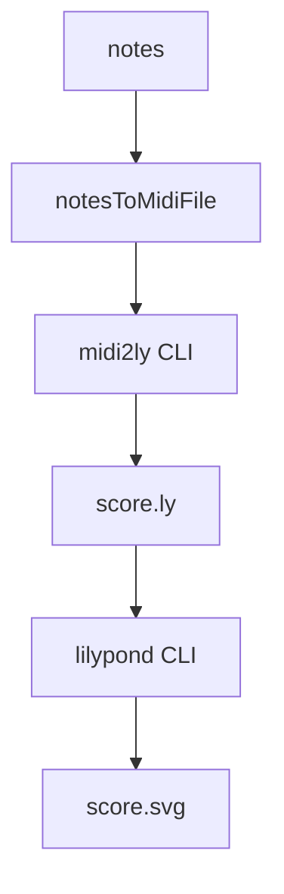

# Score rendering pipeline research

## Pipeline in this app

1) UI triggers server render

- The UI calls a server function with the current note list.
- `src/components/ScoreDisplay.tsx` shows the client call path:

```
const { mutate: renderLilypond, isPending: isLilypondLoading } = useMutation({
  mutationFn: async (noteData: readonly Note[]) => {
    const response = await renderLilyPondSvg({ data: { notes: noteData } });
    return await response.text();
  },
  onSuccess: (svg) => {
    setLilypondSvg(svg);
  },
});
```

2) API handler invokes LilyPond renderer

- The server function forwards notes into the renderer and returns SVG.
- `src/routes/api/score/-lilypond.ts`:

```
const svgBytes = yield* renderer.renderToSvg(data.notes);
return new Response(result, {
  headers: { "Content-Type": "image/svg+xml" },
});
```

3) Renderer writes debug MIDI, then renders LilyPond to SVG

- Rendering uses LilyPond CLI to convert a generated `.ly` string to SVG.
- MIDI is generated and written to `logs/score-debug.mid` but not used for the SVG render.
- `src/lib/lilypond/renderer.ts`:

```
const midiBuffer = notesToMidiFile(quantizeNotes(notes));
const debugDir = path.join(process.cwd(), "logs");
const debugMidiPath = path.join(debugDir, "score-debug.mid");
...
yield* fs.writeFile(debugMidiPath, midiBuffer)
...
const lyContent = notesToLilyPond(notes);
...
yield* spawner.string(
  ChildProcess.make("lilypond", [
    "-dbackend=svg",
    "-o",
    outputBase,
    tmpLy,
  ]),
);
return yield* fs.readFile(`${outputBase}.svg`);
```

4) LilyPond source is generated directly from notes

- The LilyPond input string includes `\score`, `\layout`, and `\midi` blocks.
- `src/lib/lilypond/score.ts`:

```
return [
  String.raw`\version "2.24.4"`,
  "",
  String.raw`\score {`,
  String.raw`  \new Staff {`,
  ...
  String.raw`  \layout {}`,
  String.raw`  \midi {}`,
  "}",
].join("\n");
```

## Mermaid diagrams

### Actual pipeline (current code)

```mermaid
flowchart TD
  A[UI: ScoreDisplay] -->|renderLilyPondSvg| B[Server fn: /api/score/-lilypond]
  B --> C[LilyPondRenderer.renderToSvg]
  C --> D[notesToLilyPond -> score.ly]
  C --> E[notesToMidiFile -> logs/score-debug.mid (debug only)]
  D --> F[lilypond CLI: -dbackend=svg]
  F --> G[score.svg]
  G --> H[Response: image/svg+xml]
```

### Not used (hypothetical MIDI->LilyPond path)



## Are we converting the note list to MIDI first?

- The rendering pipeline does not convert MIDI to LilyPond. It generates LilyPond directly from the note list and uses the LilyPond CLI to render SVG.
- A MIDI file is still created from the notes, but it is written only as a debug artifact in `logs/score-debug.mid`.
- Evidence in `src/lib/lilypond/renderer.ts` shows MIDI creation and debug write, followed by `notesToLilyPond` and the `lilypond` CLI call (see excerpt above).
 - `midi2ly` is not part of the runtime pipeline in this codebase.

## MIDI file format in use

### MidiWriterJS outputs Standard MIDI File chunks

- `refs/midi-writer/src/constants.ts` describes SMF header/track chunks:

```
HEADER_CHUNK_TYPE      : [0x4d, 0x54, 0x68, 0x64], // Mthd
HEADER_CHUNK_LENGTH    : [0x00, 0x00, 0x00, 0x06], // Header size for SMF
TRACK_CHUNK_TYPE       : [0x4d, 0x54, 0x72, 0x6b], // MTrk,
```

### Format 0 vs Format 1

- MidiWriterJS selects format 0 for a single track and format 1 for multiple tracks.
- `refs/midi-writer/src/chunks/header.ts`:

```
const trackType = numberOfTracks > 1? Constants.HEADER_CHUNK_FORMAT1 : Constants.HEADER_CHUNK_FORMAT0;
```

### Which one does this app use?

- The app builds a single `Track`, then creates a `Writer(track, { ticksPerBeat })`.
- `src/lib/lilypond/midi.ts`:

```
const track = new Track();
...
return new Writer(track, { ticksPerBeat }).buildFile();
```

- Because it passes a single track, MidiWriterJS emits **SMF Type 0**. Type 0 is the single-track Standard MIDI File format; Type 1 is multi-track with synchronous timing.
- This app also sets `ticksPerBeat` to 480 when building the file (`notesToMidiFile` default argument), which influences timing resolution in the SMF header.

## LilyPond: MIDI to LilyPond CLI

- LilyPond ships a `midi2ly` script that converts MIDI to LilyPond input.
- `refs/lilypond/scripts/midi2ly.py`:

```
# midi2ly.py -- LilyPond midi import script
...
p = ly.get_option_parser(usage=_("%s [OPTION]... FILE") % 'midi2ly',
                         description=_(
                             "Convert %s to LilyPond input.\n") % 'MIDI',
                         add_help_option=False)
```

- Example usage is included in the script:

```
$ midi2ly --key=-2:1 --duration-quant=32 --allow-tuplet=4*2/3 --allow-tuplet=2*4/3 foo.midi
```

## Answers to your questions (concise)

- Rendering pipeline: UI -> `renderLilyPondSvg` API -> `LilyPondRenderer.renderToSvg` -> generate `.ly` -> run `lilypond` CLI -> SVG returned to client.
- Note list to MIDI first? No. MIDI is created only as a debug artifact, not used in the render pipeline.
- MIDI format: SMF with `MThd`/`MTrk` chunks. For a single track, MidiWriterJS selects **Type 0** (single-track). Type 1 is used only when there are multiple tracks.
- LilyPond conversion: `midi2ly` is the CLI that converts MIDI into LilyPond input.
